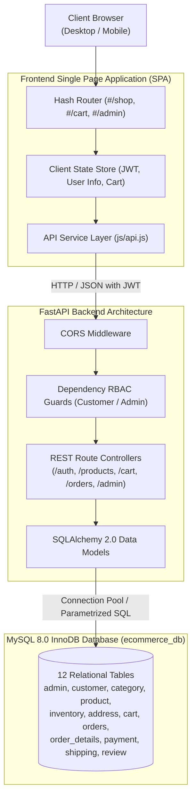

# NexCart — Advanced E-Commerce Order Management System

> *"Your Next Shopping Experience"* — A full-stack, enterprise-grade e-commerce order management system engineered with Python FastAPI, SQLAlchemy 2.0, and MySQL 8.0 (InnoDB), paired with a high-performance, responsive single-page storefront.

[](LICENSE)
[](https://www.python.org/)
[](https://fastapi.tiangolo.com/)
[](https://www.mysql.com/)
[](https://tailwindcss.com/)
[](https://render.com/)

---

## 1. Project Overview

**NexCart** is an Advanced E-Commerce Order Management System designed to bridge modern web design with strict relational database integrity. Developed as an advanced DBMS and full-stack software engineering project, NexCart enforces strict ACID transactional guarantees, real-time inventory synchronization, role-based access control (RBAC), and full-lifecycle order consignment tracking.

The application features:
- A responsive, glassmorphic **Customer Storefront** providing seamless catalog exploration, live search, multi-address delivery selection, shopping cart management, interactive checkout, and visual tracking steppers.
- An **Executive Administrator Portal** equipped with real-time MySQL analytics charts (monthly revenue trends, order status distributions, top-selling products, and warehouse stock health), along with catalog CRUD controls and orphan-protected category management.

---

## 2. Project Objectives

1. **Relational Database Integrity**: Implement a 12-table normalized relational schema in MySQL 8.0 InnoDB, demonstrating exact 1:1, 1:M, and M:N relationship representations.
2. **ACID Transaction Guarantees**: Prevent overselling and race conditions during checkout through atomic SQL transactions that decrement inventory, create orders, link payments, generate consignments, and clear active cart items within a single database transaction.
3. **Enterprise Authentication**: Provide cryptographically secure authentication using BCrypt password hashing (round 12) and stateless JSON Web Tokens (JWT) with separate claims for customers and administrators.
4. **Operations & Observability**: Aggregate business intelligence directly from MySQL InnoDB tables to display live revenue metrics, inventory low-stock alerts, and order progression states.
5. **Zero-Lock Cloud Deployment**: Support seamless dual-mode execution for local development and cloud deployment across Render and hosted MySQL platforms.

---

## 3. Key Features

### Customer Experience
- **Storefront & Catalog**: Browse products across 5 departments with dynamic search, category filtering, and sorting.
- **Product Details & Community Reviews**: High-resolution imagery, real-time stock availability badges, and customer ratings.
- **Shopping Cart**: Real-time quantity adjustments, price recalculations, and persistent cart storage per customer.
- **Multiple Address Book**: Save multiple shipping destinations (Home, Office, College) with default address selection.
- **Interactive Checkout**: Delivery destination selection and payment method simulation including **PhonePe Gateway (UAT Sandbox)**, UPI Demo, Card Demo, and Cash on Delivery.
- **Consignment Tracking Stepper**: Visual milestone tracker tracking shipments from *Order Placed* $\rightarrow$ *Processing* $\rightarrow$ *Shipped* $\rightarrow$ *Delivered*.
- **Account Security**: Secure login/registration, password visibility eye toggles, in-app password changes, and a two-step 15-minute tokenized password recovery mechanism.

### Administrator Operations
- **Analytics Dashboard**: Live charts displaying Monthly Revenue, Order Status Distribution, Top 5 Best-Selling Products, and Category Contribution.
- **Warehouse Inventory Control**: Live stock level monitoring with low-stock warnings ($\le$ threshold), out-of-stock badges, and instant unit restock adjustments.
- **Product Catalog Management**: Full CRUD capabilities to create new products with 1:1 inventory allocation, update details, toggle active/archived status, and safely delete unreferenced products.
- **Category Hierarchy Manager**: Department management with **Referential Integrity Protection** (safely rejects category deletion if active products remain linked).
- **Order Invoices & Consignments**: Platform-wide transaction stream with order status advancement (`Confirmed` $\rightarrow$ `Processing` $\rightarrow$ `Shipped` $\rightarrow$ `Delivered` $\rightarrow$ `Cancelled`) and milestone timestamp synchronization.

---

## 4. Technology Stack

| Layer | Technology | Description |
| :--- | :--- | :--- |
| **Frontend** | HTML5, Vanilla JavaScript (ES Modules) | High-performance Single Page Application (SPA) architecture |
| **Styling** | Tailwind CSS (CDN) | Modern responsive utility classes, custom design tokens, glassmorphism |
| **Icons** | Lucide Icons (CDN) | Lightweight, accessible SVG vector icon system |
| **Backend API** | FastAPI (Python 3.10+) | High-performance ASGI REST API framework with automatic OpenAPI docs |
| **ASGI Server** | Uvicorn | Production-ready asynchronous web server implementation |
| **ORM & Database Client** | SQLAlchemy 2.0 & PyMySQL | Object-Relational Mapping with connection pooling and parameterization |
| **Database Engine** | MySQL Server 8.0 (InnoDB) | ACID-compliant relational database engine with strict foreign keys |
| **Security & Cryptography** | BCrypt & Python-JOSE | Password hashing (salt rounds 12) and HMAC-SHA256 JWT tokens |
| **Validation** | Pydantic v2 & Pydantic-Settings | Type-safe request/response serialization and environment validation |

---

## 5. System Architecture



---

## 6. Project Folder Structure

```
NexCart/
├── .gitignore                      # Git exclusion rules (.env, .venv, caches)
├── LICENSE                         # Standard MIT Open-Source License
├── README.md                       # Comprehensive project documentation
├── backend/                        # FastAPI Backend Application
│   ├── .env.example                # Safe environment variables configuration template
│   ├── requirements.txt            # Python dependencies (FastAPI, SQLAlchemy, PyMySQL, etc.)
│   ├── run.py                      # Local development startup entrypoint script
│   └── app/
│       ├── main.py                 # FastAPI application factory, CORS, and router registration
│       ├── config/
│       │   └── settings.py         # Pydantic BaseSettings, environment loader, production guards
│       ├── database/
│       │   └── session.py          # SQLAlchemy engine, connection pool, and get_db session dependency
│       ├── models/                 # SQLAlchemy 2.0 ORM Entity Definitions
│       │   ├── address.py          # Entity 6: Delivery destination addresses
│       │   ├── admin.py            # Entity 1: Administrator accounts
│       │   ├── cart.py             # Entity 7: Shopping cart item entries
│       │   ├── category.py         # Entity 3: Product departments
│       │   ├── customer.py         # Entity 2: Registered shopper profiles
│       │   ├── inventory.py        # Entity 5: 1:1 Warehouse stock allocations
│       │   ├── order.py            # Entity 8: Customer purchase orders
│       │   ├── order_detail.py     # Entity 9: Line item product snapshots
│       │   ├── payment.py          # Entity 10: 1:1 Transaction records
│       │   ├── product.py          # Entity 4: Catalog products
│       │   ├── review.py           # Entity 12: Customer product ratings
│       │   └── shipping.py         # Entity 11: 1:1 Consignment tracking records
│       ├── routes/                 # REST API Route Endpoints
│       │   ├── addresses.py        # Customer address book CRUD
│       │   ├── admin.py            # Analytics metrics, catalog CRUD, category manager, restock
│       │   ├── auth.py             # Register, login, change password, forgot/reset password
│       │   ├── cart.py             # Cart item addition, quantity updates, deletion
│       │   ├── categories.py       # Public category listing
│       │   ├── health.py           # Database connectivity and diagnostic endpoints
│       │   ├── orders.py           # ACID checkout, order history, tracking stepper, PhonePe status
│       │   ├── products.py         # Catalog listing, search, filtering, featured items
│       │   └── reviews.py          # Verified customer product review submissions
│       ├── schemas/                # Pydantic request validation and response contracts
│       └── utils/                  # Security utilities (BCrypt, JWT tokens, RBAC dependencies)
├── database/                       # MySQL 8.0 Database Scripts
│   ├── 01_schema_creation.sql      # DDL: 12 InnoDB tables, primary keys, foreign keys, constraints
│   ├── 02_sample_data.sql          # DML: Verified sample dataset (2 admins, 4 customers, 14 products, etc.)
│   ├── 03_verification_queries.sql # SQL test suite verifying relationships and row counts
│   └── sql.mwb                     # MySQL Workbench visual EER relational model file
└── frontend/                       # Client Single Page Application (SPA)
    ├── index.html                  # Core HTML shell with Tailwind and Lucide CDN links
    ├── css/
    │   └── style.css               # Custom scrollbars, glassmorphism, animations
    └── js/
        ├── api.js                  # Centralized HTTP client (Local vs Cloud dynamic switching)
        ├── app.js                  # Frontend bootloader and initialization
        ├── router.js               # Hash-based SPA client router
        ├── state.js                # Reactive authentication, user, and cart state manager
        ├── components/
        │   ├── footer.js           # Professional store footer and customer care links
        │   ├── navbar.js           # Sticky header, search input, cart badge, change password modal
        │   └── toast.js            # Non-blocking notification toasts
        └── pages/                  # Page Component Renderers
            ├── addresses.js        # Address book management page
            ├── admin.js            # Executive operations portal, analytics charts, catalog CRUD
            ├── auth.js             # Sign-in, register, password visibility toggles, recovery form
            ├── cart.js             # Shopping cart item management and order summary
            ├── checkout.js         # Delivery destination picker, PhonePe payment option, checkout
            ├── home.js             # Hero banner, category showcase, featured products, trust stats
            ├── orders.js           # Customer invoice history and order status badges
            ├── productDetail.js    # Single product view, specifications, reviews
            ├── shop.js             # Filterable catalog grid with live search and price sorting
            └── tracking.js         # Public and authenticated shipment milestone stepper
```

---

## 7. Database Architecture & 12 Entities

The database schema is fully normalized and implemented in **MySQL Server 8.0** using the **InnoDB** storage engine to support foreign key constraints and ACID transactions.

| # | Entity Table | Primary Key | Foreign Keys | Cardinality / Description |
| :-: | :--- | :--- | :--- | :--- |
| **1** | `admin` | `admin_id` | — | Independent RBAC administrative entity. |
| **2** | `customer` | `customer_id` | — | Core shopper accounts with hashed credentials and contact info. |
| **3** | `category` | `category_id` | — | Product departments and catalog classifications. |
| **4** | `product` | `product_id` | `category_id` | Catalog items with pricing, slugs, and department linkage. |
| **5** | `inventory` | `inventory_id` | `product_id` (UNIQUE) | **Strict 1:1** stock allocation, reorder levels, and restock timestamps. |
| **6** | `address` | `address_id` | `customer_id` | **1:M** delivery destinations per customer (Home, Office, etc.). |
| **7** | `cart` | `cart_id` | `customer_id`, `product_id` | **1:M** active shopping basket items prior to checkout. |
| **8** | `orders` | `order_id` | `customer_id`, `address_id` | **1:M** customer purchase orders and gross total values. |
| **9** | `order_details`| `order_detail_id`| `order_id`, `product_id` | **1:M** order line items recording unit price snapshot at purchase. |
| **10**| `payment` | `payment_id` | `order_id` (UNIQUE) | **Strict 1:1** payment transaction records and payment methods. |
| **11**| `shipping` | `shipping_id` | `order_id` (UNIQUE) | **Strict 1:1** carrier tracking numbers, status, and milestone dates. |
| **12**| `review` | `review_id` | `product_id`, `customer_id` | **1:M** customer product feedback, ratings (1–5), and comments. |

### Relational Cardinalities
- $\text{Customer} \xrightarrow{1:M} \text{Address}$
- $\text{Customer} \xrightarrow{1:M} \text{Cart}$
- $\text{Customer} \xrightarrow{1:M} \text{Order}$
- $\text{Category} \xrightarrow{1:M} \text{Product}$
- $\text{Product} \xleftrightarrow{1:1} \text{Inventory}$ *(Enforced via `product_id UNIQUE` constraint)*
- $\text{Order} \xleftrightarrow{1:1} \text{Payment}$ *(Enforced via `order_id UNIQUE` constraint)*
- $\text{Order} \xleftrightarrow{1:1} \text{Shipping}$ *(Enforced via `order_id UNIQUE` constraint)*
- $\text{Order} \xrightarrow{1:M} \text{Order Details} \xleftarrow{M:1} \text{Product}$
- $\text{Product} \xrightarrow{1:M} \text{Review} \xleftarrow{M:1} \text{Customer}$

---

## 8. Prerequisites & Requirements

- **Operating System**: Windows 10/11, macOS, or Linux.
- **Python**: Version `3.10` or higher (verified with Python 3.11 / 3.13).
- **MySQL Server**: Version `8.0` or higher (InnoDB storage engine enabled).
- **Web Browser**: Any modern browser (Google Chrome, Microsoft Edge, Firefox, Brave).

---

## 9. Local Installation & Setup (Windows)

### Step 1: Clone the Repository
```powershell
git clone https://github.com/divya-4k49/NexCart.git
cd NexCart
```

### Step 2: Set Up Python Virtual Environment
```powershell
cd backend
python -m venv .venv
.\.venv\Scripts\Activate.ps1
pip install --upgrade pip
pip install -r requirements.txt
```

### Step 3: Set Up MySQL Database
1. Open **MySQL Command Line Client** or **MySQL Workbench**.
2. Run the SQL scripts in strict sequence from the `database/` directory:

```sql
-- 1. Create database schema, tables, and foreign key constraints
SOURCE C:/path/to/NexCart/database/01_schema_creation.sql;

-- 2. Populate verified project sample data
SOURCE C:/path/to/NexCart/database/02_sample_data.sql;

-- 3. (Optional) Run verification suite to verify table row counts
SOURCE C:/path/to/NexCart/database/03_verification_queries.sql;
```

### Step 4: Configure Environment Variables
Inside the `backend/` directory, create a `.env` file using `.env.example` as a template:

```powershell
Copy-Item .env.example .env
```

Open `.env` in any text editor and configure your local MySQL credentials:

```ini
DB_HOST=localhost
DB_PORT=3306
DB_NAME=ecommerce_db
DB_USER=root
DB_PASSWORD=your_local_mysql_password

SECRET_KEY=your_secure_development_jwt_secret_key_min_32_characters
ALGORITHM=HS256
ACCESS_TOKEN_EXPIRE_MINUTES=1440

ENVIRONMENT=development
FRONTEND_ORIGINS=http://localhost:5173,http://localhost:3000,http://127.0.0.1:3000,http://127.0.0.1:5173

PHONEPE_MERCHANT_ID=PGTESTPAYUAT
PHONEPE_SALT_KEY=099eb0cd-02cf-4e2a-8aca-3e6c6aff0399
PHONEPE_SALT_INDEX=1
PHONEPE_ENV=UAT
PHONEPE_CALLBACK_URL=http://localhost:8000/api/orders/payment/phonepe/callback
```

---

## 10. Running the Application Locally

### 1. Launch the FastAPI Backend Server
From the `backend/` directory with the virtual environment activated:

```powershell
.\.venv\Scripts\uvicorn.exe app.main:app --reload --host 127.0.0.1 --port 8000
```
- API Base URL: `http://127.0.0.1:8000`
- Swagger Interactive Docs: `http://127.0.0.1:8000/docs`
- ReDoc Documentation: `http://127.0.0.1:8000/redoc`
- Health Diagnostic: `http://127.0.0.1:8000/api/health`

### 2. Launch the Frontend
Open a **new** PowerShell terminal window and navigate to the `frontend/` directory:

```powershell
cd C:\path\to\NexCart\frontend
python -m http.server 3000
```
- Open your browser and navigate to: **`http://localhost:3000`**

*(Alternatively, the FastAPI backend mounts the frontend at `http://127.0.0.1:8000/app`)*.

---

## 11. Verified Sample Data & Demo Accounts

The project includes an authentic sample dataset in `database/02_sample_data.sql` for grading and demonstration:

- **Administrators**: 2 accounts (`superadmin` and `manager_rahul`).
- **Customers**: 4 accounts (`Aarav Patel`, `Priya Nair`, `Rohan Verma`, `Ananya Iyer`).
- **Categories**: 5 product departments.
- **Products**: 14 catalog items across laptops, smartphones, audio, wearables, and peripherals.
- **Inventory**: 14 records with a strict 1:1 ratio matching catalog items.

> [!NOTE]
> For grading and testing, sample accounts are populated from `database/02_sample_data.sql`. You can sign up with a new shopper account directly via `#/register` at any time, or refer to the comments within `02_sample_data.sql` when evaluating locally.

---

## 12. REST API Specification Overview

The backend exposes over 30 REST endpoints:

| Domain | Method | Endpoint | Access | Purpose |
| :--- | :---: | :--- | :---: | :--- |
| **Health** | `GET` | `/api/health` | Public | System & MySQL connection liveness check |
| **Auth** | `POST` | `/api/auth/customer/register` | Public | New customer registration |
| **Auth** | `POST` | `/api/auth/customer/login` | Public | Customer JWT authentication |
| **Auth** | `POST` | `/api/auth/admin/login` | Public | Administrator JWT authentication |
| **Auth** | `POST` | `/api/auth/customer/change-password` | Customer | Authenticated customer password change |
| **Auth** | `POST` | `/api/auth/admin/change-password` | Admin | Authenticated admin password change |
| **Auth** | `POST` | `/api/auth/forgot-password/request` | Public | Request 15-minute password reset token |
| **Auth** | `POST` | `/api/auth/forgot-password/reset` | Public | Verify token and reset account password |
| **Catalog** | `GET` | `/api/products` | Public | Paginated and filterable product listing |
| **Catalog** | `GET` | `/api/products/{id}` | Public | Product detail specifications and reviews |
| **Catalog** | `GET` | `/api/categories` | Public | Department category listings |
| **Cart** | `GET` | `/api/cart` | Customer | Retrieve current shopping cart items |
| **Cart** | `POST` | `/api/cart` | Customer | Add product to cart with quantity |
| **Cart** | `PUT` | `/api/cart/{cart_id}` | Customer | Update cart item quantity |
| **Cart** | `DELETE`| `/api/cart/{cart_id}` | Customer | Remove item from cart |
| **Orders** | `POST` | `/api/orders/checkout` | Customer | **ACID transaction checkout** |
| **Orders** | `GET` | `/api/orders` | Customer | Retrieve customer's past order invoices |
| **Orders** | `GET` | `/api/orders/{id}/tracking` | Customer | Retrieve visual shipment tracking stepper |
| **Tracking**| `GET` | `/api/orders/track/{tracking_num}` | Public | Public shipment lookup by tracking number |
| **PhonePe** | `GET` | `/api/orders/payment/phonepe/status` | Public | PhonePe gateway sandbox readiness check |
| **Admin** | `GET` | `/api/admin/analytics` | Admin | Aggregate monthly revenue & status charts |
| **Admin** | `GET` | `/api/admin/products` | Admin | Full catalog list with stock levels |
| **Admin** | `POST` | `/api/admin/products` | Admin | Add new product + atomic 1:1 inventory |
| **Admin** | `PUT` | `/api/admin/products/{id}` | Admin | Update product specifications |
| **Admin** | `PUT` | `/api/admin/products/{id}/toggle-status`| Admin | Toggle product between Active & Archived |
| **Admin** | `DELETE`| `/api/admin/products/{id}` | Admin | Safe delete or archive if order history exists |
| **Admin** | `GET` | `/api/admin/categories` | Admin | List all categories with product counts |
| **Admin** | `POST` | `/api/admin/categories` | Admin | Create new category department |
| **Admin** | `PUT` | `/api/admin/categories/{id}` | Admin | Update category details |
| **Admin** | `DELETE`| `/api/admin/categories/{id}` | Admin | Safe delete with orphan product protection |
| **Admin** | `GET` | `/api/admin/inventory` | Admin | Inventory stock levels & low stock filter |
| **Admin** | `PUT` | `/api/admin/inventory/{id}` | Admin | Restock product stock units |
| **Admin** | `PUT` | `/api/admin/orders/{id}/status` | Admin | Advance order lifecycle status & milestones |

---

## 13. Render Cloud Deployment Guide

To host NexCart online so it remains accessible **even when your local laptop is powered off**, deploy the three components to cloud infrastructure:

### Step 1: Deploy Hosted MySQL Database (e.g. TiDB Cloud / Aiven)
1. Create a free MySQL 8.0 instance on a managed cloud database provider (e.g., TiDB Cloud Serverless or Aiven MySQL).
2. Connect to the cloud instance using MySQL Workbench.
3. Execute `database/01_schema_creation.sql` to establish the schema.
4. Execute `database/02_sample_data.sql` to seed the verified data.
5. Copy the external MySQL connection URL (e.g., `mysql+pymysql://<user>:<password>@<host>:<port>/<dbname>?charset=utf8mb4`).

### Step 2: Deploy Backend to Render (Web Service)
1. Log in to [Render](https://render.com/) and create a **New Web Service**.
2. Connect your GitHub repository `https://github.com/divya-4k49/NexCart`.
3. Configure the service:
   - **Root Directory**: `backend`
   - **Runtime**: `Python 3`
   - **Build Command**: `pip install -r requirements.txt`
   - **Start Command**: `uvicorn app.main:app --host 0.0.0.0 --port $PORT`
4. Set Environment Variables in Render Dashboard:
   - `DATABASE_URL`: *(Your cloud MySQL connection string from Step 1)*
   - `SECRET_KEY`: *(Generate a secure 64-char key: `python -c "import secrets; print(secrets.token_hex(32))"`)*
   - `ENVIRONMENT`: `production`
   - `FRONTEND_ORIGINS`: `https://your-frontend.onrender.com,http://localhost:3000`
   - `PHONEPE_ENV`: `UAT`
   - `PHONEPE_MERCHANT_ID`: `PGTESTPAYUAT`
   - `PHONEPE_SALT_KEY`: `099eb0cd-02cf-4e2a-8aca-3e6c6aff0399`
   - `PHONEPE_SALT_INDEX`: `1`

### Step 3: Deploy Frontend to Render (Static Site)
1. In Render, create a **New Static Site**.
2. Select the same GitHub repository.
3. Configure:
   - **Root Directory**: `frontend`
   - **Build Command**: *(Leave empty — vanilla JS requires no build step)*
   - **Publish Directory**: `.`
4. In `frontend/js/api.js`, update `DEFAULT_PRODUCTION_API_URL` to point to your deployed backend Web Service (e.g., `https://nexcart-api.onrender.com/api`).

---

## 14. Security & Data Protection Notes

- **Password Hashing**: Passwords are never stored in plaintext. They are salted and hashed using BCrypt (`rounds=12`).
- **Production Secret Guardrails**: The application enforces that running in `ENVIRONMENT=production` requires a high-entropy `SECRET_KEY` ($\ge$ 32 characters) and automatically refuses to start with placeholder credentials.
- **SQL Injection Prevention**: All queries utilize SQLAlchemy ORM parameterized statements; raw SQL string concatenations are strictly forbidden.
- **Cross-Origin Resource Sharing (CORS)**: Strict origin whitelisting prevents unauthorized external domains from invoking backend endpoints.
- **Referential Integrity Protection**: Admin category deletion safely detects and blocks removal if catalog items are linked, preventing orphaned products.

---

## 15. Troubleshooting

### 1. MySQL Connection Refused (`Can't connect to MySQL server`)
- Ensure your local MySQL 8.0 Windows service is running:
  ```powershell
  Get-Service -Name MySQL*
  # To start:
  Start-Service -Name MySQL80
  ```
- Verify your password in `backend/.env` matches your MySQL `root` password.

### 2. Mixed Content Error in Production Browser Console
- If your frontend is served over `https://`, your backend must also be served over `https://`. Ensure `frontend/js/api.js` points to `https://...` and not `http://`.

### 3. Render Free Tier Cold Starts
- Render free-tier services spin down after 15 minutes of inactivity. When accessed after inactivity, allow 30–50 seconds for the container to wake up.

---

## 16. Future Roadmap

- [ ] Production webhook listener for live PhonePe and Razorpay callback verification.
- [ ] Automated email/SMS transactional notifications via Twilio or SendGrid.
- [ ] Multi-warehouse inventory stock tracking across regional fulfillment centers.
- [ ] Customer PDF invoice download generator.

---

## 17. Author & Academic Context

- **Developer**: Divya ([@divya-4k49](https://github.com/divya-4k49))
- **Project**: Advanced E-Commerce Order Management System (NexCart)
- **Course Context**: Database Management Systems (DBMS) & Full-Stack Web Development Project

---

## 18. License

This project is licensed under the open-source **MIT License** — see the [LICENSE](LICENSE) file for details.
